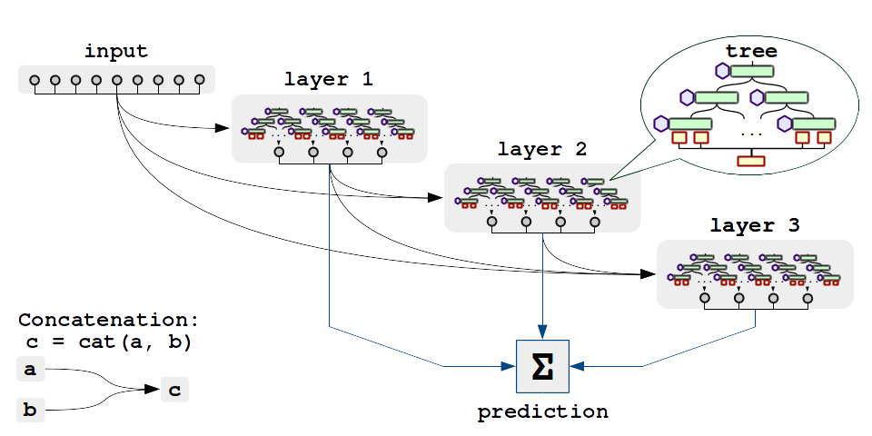

# Neural Oblivious Decision Ensembles
A supplementary code for [Neural Oblivious Decision Ensembles for Deep Learning on Tabular Data](https://arxiv.org/abs/1909.06312) paper.

# What does it do?
It learns deep ensembles of oblivious differentiable decision trees on tabular data

# What do i need to run it?
* A machine with some CPU (preferably 2+ free cores) and GPU(s)
  * Running without GPU is possible but takes 8-10x as long even on high-end CPUs
  * Our implementation is memory inefficient and may require a lot of GPU memory to converge
* Some popular Linux x64 distribution
  * Tested on Ubuntu16.04, should work fine on any popular linux64 and even MacOS;
  * Windows and x32 systems may require heavy wizardry to run;
  * When in doubt, use Docker, preferably GPU-enabled (i.e. nvidia-docker)

# How do I run it?
1. Clone or download this repo. `cd` yourself to it's root directory.
2. Grab or build a working python enviromnent. [Anaconda](https://www.anaconda.com/) works fine.
3. Install packages from `requirements.txt`
 * It is critical that you use __torch >= 1.1__, not 1.0 or earlier 
 * You will also need jupyter or some other way to work with .ipynb files
4. Run jupyter notebook and open a notebook in `./notebooks/`
 * Before you run the first cell, change `%env CUDA_VISIBLE_DEVICES=#` to an index that you plan to use.
 * The notebook downloads data from dropbox. You will need __1-5Gb__ of disk space depending on dataset.

We showcase two typical learning scenarios for classification and regression. Please consult the original paper for training details.
